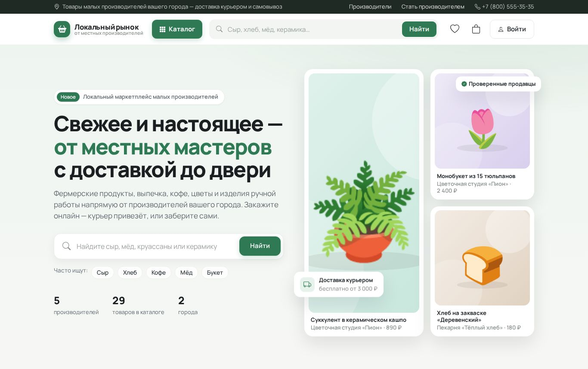
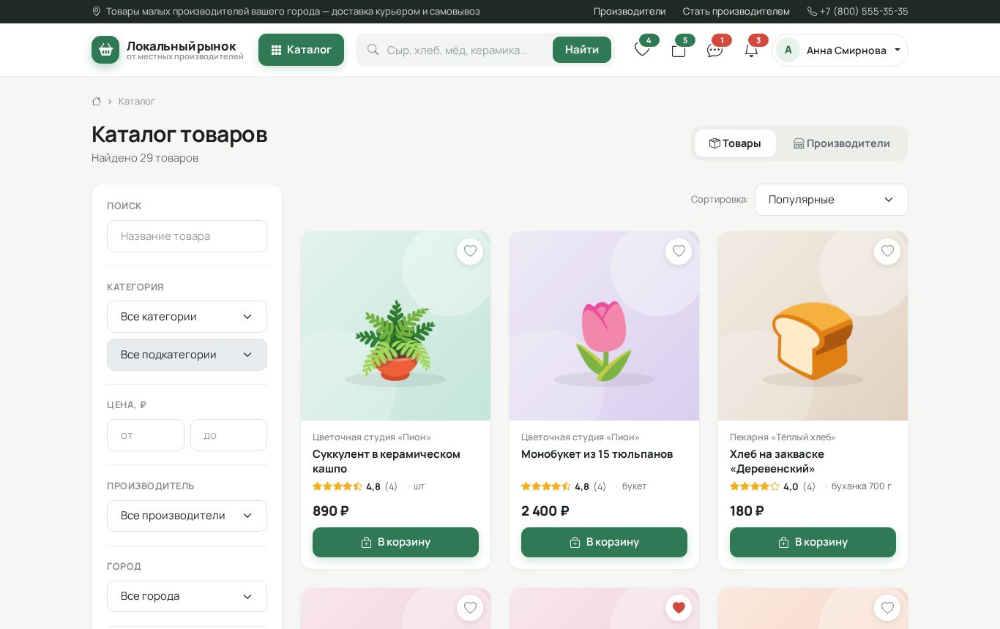
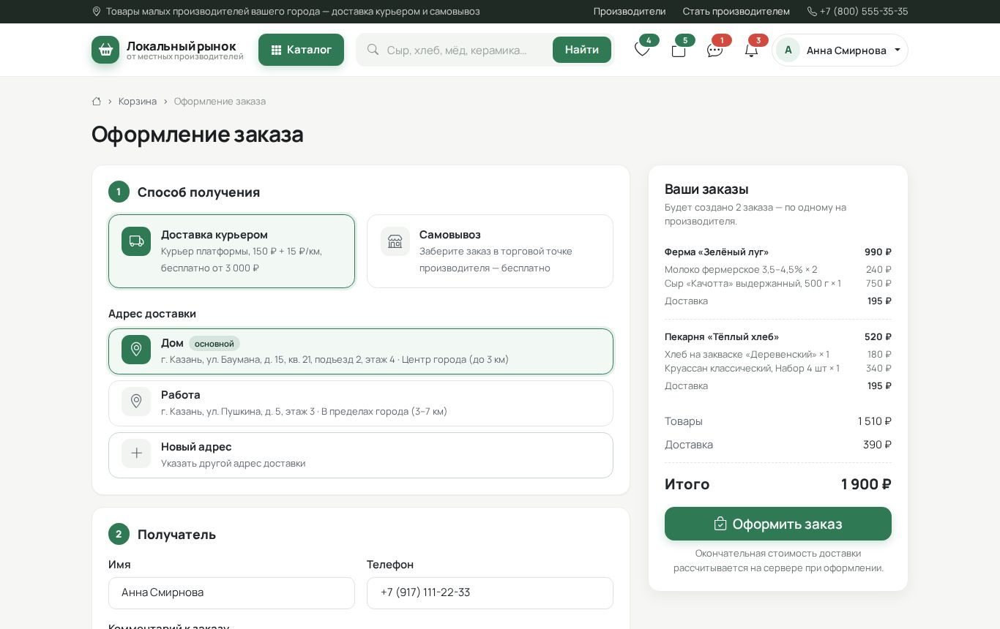
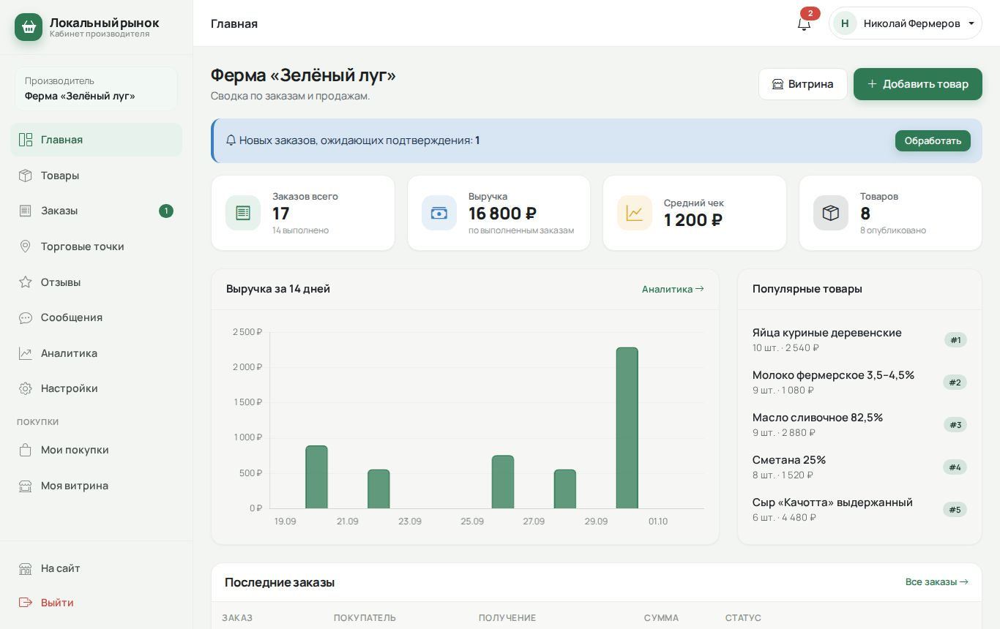
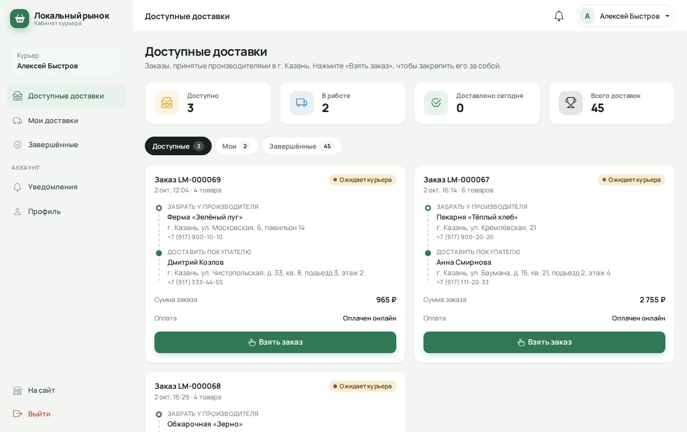
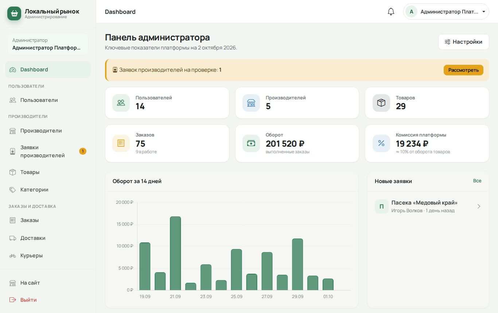
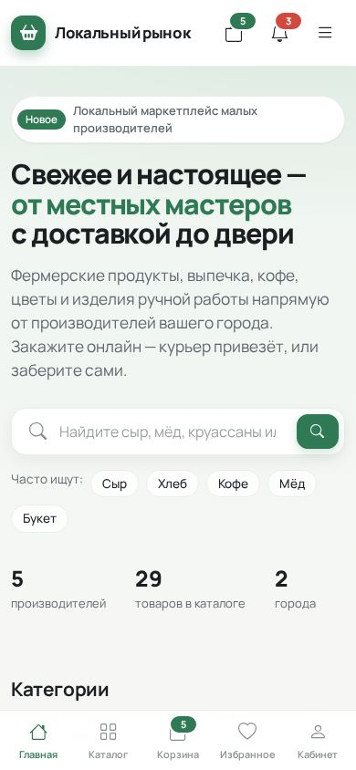

# Локальный рынок

**Тема:** «Разработка веб-платформы управления локальной торговлей и доставкой товаров от малых производителей».

Учебный веб-проект на Laravel: маркетплейс, на котором фермеры, пекарни, обжарщики кофе, флористы и мастерские продают
свои товары жителям города, а курьеры платформы доставляют заказы. Платформа не привязана к одному городу и подходит
не только для продуктов питания: в каталоге есть выпечка, напитки, цветы, керамика, свечи, косметика локальных брендов.



## Назначение

- Покупатель находит товары местных производителей, кладёт в одну корзину товары разных продавцов, оформляет заказ
  с доставкой или самовывозом, оплачивает (наличные / карта / СБП в демо-режиме), общается с продавцом в чате и оставляет отзыв.
- Производитель подаёт заявку, после одобрения ведёт витрину: товары с вариантами и фото, торговые точки, заказы, отзывы, аналитику.
- Курьер берёт доступные доставки и меняет их статус.
- Оператор помогает с проблемными заказами, доставками и жалобами.
- Администратор управляет пользователями, производителями, каталогом, промокодами и настройками платформы.

## Технологии

| Слой | Что используется |
|---|---|
| Backend | PHP 8.2+, Laravel 12 (MVC, Eloquent ORM, Form Requests, Policies, Middleware, Notifications) |
| Frontend | Blade, Bootstrap 5.3 (собственные SCSS-переменные и стили), Bootstrap Icons, обычный JavaScript (ES-модули) |
| Графики | Chart.js (подгружается только на страницах с графиками) |
| База данных | MySQL 8 (миграции, внешние ключи, индексы) |
| Файлы | Laravel Storage (диск `public`) |
| Сборка | Vite — только для сборки CSS/JS |
| Авторизация | Обычная сессионная авторизация Laravel (без JWT и отдельного API) |
| Тесты | PHPUnit (Feature + Unit) |

Не используются: React/Vue, отдельный REST-бэкенд, JWT, Docker, Redis, WebSocket, внешние платёжные системы.

## Возможности

**Витрина**
- Главная: hero-блок с большой строкой поиска, категории, популярные товары, новинки, лучшие производители, преимущества.
- Каталог с переключателем «Товары / Производители»: поиск (обычный `LIKE` в MySQL), категория → подкатегория,
  цена от/до, производитель, город, рейтинг, наличие; сортировка — популярные, новые, дешевле, дороже, высокий рейтинг.
- Карточка товара: фото, производитель, цена, рейтинг, наличие, выбор варианта, «В корзину» (AJAX), «В избранное».
- Страница товара: галерея, варианты (например, «250 г / 500 г»), описание, характеристики, отзывы с распределением оценок,
  похожие товары, вопрос производителю в чате.
- Страница производителя: логотип, описание, рейтинг, контакты, торговые точки, товары, отзывы.

**Покупатель**
- Регистрация, вход, выход, восстановление пароля, редактирование профиля.
- Корзина в БД: товары разных производителей, изменение количества без перезагрузки, промокод.
- Оформление: доставка курьером или самовывоз, адрес (сохранённый или новый), получатель, способ оплаты, комментарий.
  **Корзина автоматически делится на отдельные заказы — по одному на каждого производителя.**
- Минимальная сумма заказа и тарифы доставки берутся из настроек сайта.
- Демо-оплата картой (данные карты не отправляются и не хранятся) и по СБП (демонстрационный QR-код).
- Личный кабинет: обзор, профиль, мои заказы (с историей статусов), избранное, мои отзывы, адреса, сообщения, уведомления.
- Отзыв можно оставить только по выполненному заказу; на чужой отзыв можно пожаловаться.
- Заявка «Стать производителем».

**Производитель** — кабинет с боковым меню: Главная (заказы, выручка, средний чек, товары, популярные товары, график),
Товары (создание, редактирование, удаление, скрытие, наличие, варианты, основное и дополнительные фото), Заказы
(принять, выдать, отменить), Торговые точки, Отзывы (ответ покупателю), Сообщения, Аналитика (2 графика Chart.js), Настройки витрины.

**Курьер** — «Доступные доставки» (кнопка «Взять заказ»), «Мои доставки» («Забрал у производителя» → «Доставлено»), «Завершённые».

**Оператор** — ограниченная панель: dashboard с очередью задач, заказы (фильтр «проблемные», принять / завершить / отменить),
доставки (назначить или снять курьера), производители (просмотр), жалобы (скрыть отзыв / отклонить жалобу).

**Администратор** — полная панель: dashboard (пользователи, производители, товары, заказы, оборот, комиссия, последние заказы,
график оборота), пользователи, производители, заявки производителей, товары, категории, заказы, доставки, курьеры, операторы,
отзывы, жалобы, промокоды, настройки (комиссия, минимальная сумма заказа, стоимость доставки).

**Общее:** уведомления внутри сайта (колокольчик), чат «покупатель ↔ производитель» с AJAX-обновлением и статусом прочтения,
адаптивная вёрстка (телефон, планшет, ПК), toast-уведомления, подтверждение удаления в модальном окне, состояния загрузки,
пустые состояния, хлебные крошки, пагинация, бейджи статусов, собственные страницы ошибок 403/404/419/500.

## Роли

| Роль | Код | Что доступно |
|---|---|---|
| Покупатель | `buyer` | каталог, корзина, заказы, избранное, отзывы, адреса, чат, заявка производителя |
| Производитель | `producer` | кабинет производителя `/producer` + все функции покупателя |
| Курьер | `courier` | кабинет курьера `/courier` (доставки только в своём городе) |
| Оператор | `operator` | панель `/admin` без пользователей, категорий, промокодов и настроек |
| Администратор | `admin` | полная панель `/admin` |

Доступ проверяется middleware `role:...` (маршруты) и политиками (владелец товара, заказа, адреса, диалога).

## Требования

- PHP **8.2+** с расширениями `pdo_mysql`, `mbstring`, `openssl`, `fileinfo`, `gd` (gd нужен для тестов загрузки изображений),
  `pdo_sqlite` — для запуска тестов в памяти (необязательно, см. ниже).
- Composer 2
- Node.js **20.19+ или 22+** и npm (для Vite 7)
- MySQL 8 (или MariaDB 10.6+)

## Установка и запуск

1. **Установить зависимости PHP**
   ```bash
   composer install
   ```

2. **Создать файл окружения и ключ приложения**
   ```bash
   cp .env.example .env        # Windows: copy .env.example .env
   php artisan key:generate
   ```

3. **Создать базу данных MySQL**
   ```sql
   CREATE DATABASE local_market CHARACTER SET utf8mb4 COLLATE utf8mb4_unicode_ci;
   ```

4. **Указать доступ к базе в `.env`**
   ```dotenv
   DB_CONNECTION=mysql
   DB_HOST=127.0.0.1
   DB_PORT=3306
   DB_DATABASE=local_market
   DB_USERNAME=root
   DB_PASSWORD=
   ```

5. **Создать таблицы и заполнить демо-данными**
   ```bash
   php artisan migrate --seed
   ```
   Повторно пересоздать базу с нуля: `php artisan migrate:fresh --seed`.

6. **Открыть доступ к загруженным изображениям**
   ```bash
   php artisan storage:link
   ```

7. **Собрать CSS и JS**
   ```bash
   npm install
   npm run build
   ```
   Во время разработки можно запускать `npm run dev` (Vite с автообновлением).

8. **Запустить сервер**
   ```bash
   php artisan serve
   ```
   Сайт откроется по адресу <http://127.0.0.1:8000>.

> Письма восстановления пароля в режиме разработки не отправляются, а записываются в `storage/logs/laravel.log`
> (`MAIL_MAILER=log`) — ссылку для сброса можно скопировать оттуда.

## Демо-аккаунты

Пароль у всех аккаунтов: **`password`**. На странице входа есть кнопки быстрого входа.

| Роль | Email | Что посмотреть |
|---|---|---|
| Администратор | `admin@localmarket.test` | dashboard, заявка «Пасека «Медовый край»», настройки, промокоды |
| Оператор | `operator@localmarket.test` | проблемные заказы, доставки без курьера, жалоба на отзыв |
| Покупатель | `buyer@localmarket.test` | корзина с товарами двух производителей, заказы в разных статусах, чат, избранное |
| Покупатель | `maria@localmarket.test`, `dmitry@localmarket.test`, `elena@localmarket.test` | история заказов и отзывы |
| Покупатель с заявкой | `igor@localmarket.test` | заявка производителя на проверке |
| Производитель | `farm@localmarket.test` | Ферма «Зелёный луг» (Казань): новые заказы, аналитика, сообщения |
| Производитель | `bakery@localmarket.test` | Пекарня «Тёплый хлеб» (Казань) |
| Производитель | `coffee@localmarket.test` | Обжарочная «Зерно» (Казань) |
| Производитель | `flowers@localmarket.test` | Цветочная студия «Пион» (Казань) |
| Производитель | `craft@localmarket.test` | Мастерская «Глина и лён» (Нижний Новгород) |
| Курьер | `courier@localmarket.test` | доступные доставки в Казани, заказ в пути |
| Курьер | `courier2@localmarket.test` | курьер Нижнего Новгорода |

Промокоды: `WELCOME10` (−10%), `LOCAL300` (−300 ₽ от 2000 ₽), `SUMMER25` (истёк — для проверки сроков).

### Сценарий для демонстрации

1. Войти как `buyer@localmarket.test` → в корзине уже лежат товары фермы и пекарни → применить `WELCOME10` →
   оформить с доставкой и оплатой картой → пройти демо-оплату → появятся **два заказа**.
2. Войти как `bakery@localmarket.test` → «Заказы» → принять новый заказ.
3. Войти как `courier@localmarket.test` → «Взять заказ» → «Забрал у производителя» → «Доставлено» (заказ станет выполненным).
4. Снова войти как покупатель → открыть выполненный заказ → «Оставить отзыв».
5. Войти как `admin@localmarket.test` → «Заявки производителей» → одобрить пасеку; войти как `igor@localmarket.test` —
   теперь доступен кабинет производителя.
6. Войти как `operator@localmarket.test` → «Жалобы» → скрыть отзыв; «Заказы» → «Проблемные».

## Как устроено

```
app/
├── Enums/               статусы и типы (роль, статус заказа и доставки, способ оплаты…) с русскими подписями
├── Http/
│   ├── Controllers/     публичная часть, Account/ (покупатель), Producer/, Courier/, Admin/ (админ и оператор), Auth/
│   ├── Middleware/      EnsureUserHasRole (role:...), EnsureUserIsActive (блокировка)
│   └── Requests/        Form Requests для всех важных форм
├── Models/              Eloquent-модели и связи (hasMany, belongsTo, belongsToMany, hasOne)
├── Notifications/       SiteNotification — уведомление внутри сайта (канал database)
├── Policies/            проверка владельца: товар, заказ, адрес, точка, отзыв, диалог
├── Rules/               правило валидации телефона
├── Services/            бизнес-операции (см. ниже)
└── View/Composers/      данные для шапки: категории, счётчики корзины, уведомлений, сообщений
resources/
├── css/                 SCSS: переменные Bootstrap + собственные стили (карточки, кабинеты, чат, анимации)
├── js/                  app.js + модули: корзина, избранное, оформление, чат, графики, формы, тосты
└── views/               Blade: layouts, components, страницы по разделам
database/
├── migrations/          23 таблицы предметной области с внешними ключами и индексами
├── factories/           фабрики для тестов
└── seeders/             демо-данные (изображения генерируются в Storage)
routes/web.php, routes/auth.php
tests/Feature, tests/Unit
```

**Сервисы** (`app/Services`) — то, что является отдельной бизнес-операцией:

| Сервис | Ответственность |
|---|---|
| `CartService` | добавление в корзину, количество, промокод, итоги по производителям |
| `CheckoutService` | оформление: проверки, **разделение корзины на заказы по производителям**, распределение скидки, создание доставок |
| `OrderService` | статусы заказа: принять, выполнить, отменить + уведомления |
| `DeliveryService` | формула стоимости доставки, «взять заказ» (атомарно), в пути, доставлено, назначение курьера оператором |
| `ReviewService` | право на отзыв, создание, скрытие, пересчёт рейтингов |
| `ProducerApplicationService` | подача, одобрение и отклонение заявки производителя |
| `AnalyticsService` | показатели и данные графиков для кабинета производителя и админки |

Простые CRUD-операции (адреса, торговые точки, категории, промокоды) оставлены в контроллерах.

**База данных:** `users`, `cities`, `producers`, `producer_applications`, `producer_locations`, `categories`, `products`,
`product_variants`, `product_images`, `favorites`, `addresses`, `carts`, `cart_items`, `orders`, `order_items`, `deliveries`,
`reviews`, `review_reports`, `conversations`, `messages`, `notifications`, `promo_codes`, `settings` (+ служебные `sessions`,
`cache`, `password_reset_tokens`).

**Ключевые правила:**
- Статусы заказа: Новый → Принят → Выполнен / Отменён. Статусы доставки: Ожидает курьера → Курьер назначен → В пути → Доставлено.
- Стоимость доставки = `delivery_base_cost` + `delivery_cost_per_km` × удалённость адреса; бесплатно, если сумма товаров
  заказа ≥ `delivery_free_from`. Удалённость покупатель выбирает зоной при вводе адреса (без карт и GPS).
- Доставка работает в пределах города производителя; из другого города — самовывоз.
- Комиссия платформы (`platform_commission_percent`) фиксируется в заказе при оформлении и считается от суммы товаров после скидки.
- Минимальная сумма заказа проверяется для каждого производителя отдельно (каждая группа корзины — отдельный заказ).
- Товары видны в каталоге, только если они не скрыты и производитель подтверждён администратором.
- Товары удаляются «мягко» (soft delete) — старые заказы и отзывы сохраняются.

## Тесты

```bash
php artisan test
```

49 тестов (Feature + Unit): регистрация, вход, восстановление пароля, доступ по ролям, создание и защита товаров,
корзина, оформление заказа (разделение по производителям, минимальная сумма, самовывоз, промокод, демо-оплата),
полный цикл «производитель → курьер → отзыв», действия администратора и оператора (заявки, блокировка производителя,
настройки, проблемные заказы), расчёт промокодов и хелперы.

По умолчанию тесты используют SQLite в памяти (`phpunit.xml`) и не трогают рабочую базу. Если расширения `pdo_sqlite` нет,
можно создать отдельную MySQL-базу и запустить так:

```bash
DB_CONNECTION=mysql DB_DATABASE=local_market_test php artisan test
```

## Что сознательно упрощено

- **Оплата** — демонстрационная: без платёжного шлюза, данные карты не передаются на сервер; при отмене оплаченного
  заказа возврат денег не выполняется.
- **Наличие** — только «есть / нет в наличии», без количественного складского учёта.
- **Доставка** — без карт, геокодинга и GPS: расстояние задаётся зоной удалённости адреса, курьер меняет статусы кнопками.
- **Чат** — без WebSocket: сообщения подгружаются AJAX-опросом раз в 4 секунды.
- **Уведомления** — только внутри сайта; email-канал можно добавить в `SiteNotification::via()`.
- **Корзина** — только для авторизованных покупателей (гость при добавлении товара попадает на страницу входа).
- **Промокоды** — без лимитов использования и персональных условий.
- **Аналитика** — базовые показатели и два вида графиков, без выгрузок и отчётов.
- **Изображения демо-данных** — сгенерированные SVG-иллюстрации вместо фотографий; загружаемые пользователями фото — JPG/PNG/WEBP до 2 МБ.

## Скриншоты

| Каталог | Оформление заказа |
|---|---|
|  |  |
| **Кабинет производителя** | **Кабинет курьера** |
|  |  |
| **Админ-панель** | **Мобильная версия** |
|  |  |

## Возможные проблемы

- **Не видны изображения** — выполните `php artisan storage:link`.
- **Ошибка `Vite manifest not found`** — выполните `npm install && npm run build`.
- **`SQLSTATE[HY000] [1045]` / `[1049]`** — проверьте логин, пароль и имя базы в `.env`, создайте базу (шаг 3).
- **После изменения `.env` ничего не меняется** — `php artisan config:clear`.
